# Introducción a Unity 2D - Físicas y Tilemaps
1. Crear una escena simple sobre la que probar diferentes configuraciones de objetos físicos en Unity. Incluye scripts para cada uno de los tipos de objetos: Dinámico, Cinemático, Estático y prográmales eventos OnCollision2D y OnTrigger2D que muestren un mensaje con cada uno de los tipos de evento en consola. Configura adecuadamente el collider y/o Rigidbody, además del evento que corresponda para poder imprimir el mensaje en la consola. En caso de no poderse indicar por qué.

- Ninguno de los objetos será físico.

Para que se detecten colisiones, al menos uno de los objetos involucrados debe ser físico, es decir, tener un componente Rigidbody2D. En caso contrario, no se emitirán eventos relacionados con colisiones entre esos objetos.

Scripts: [DynamicCrate.cs](scripts/DynamicCrate.cs) [StaticCrate.cs](scripts/StaticCrate.cs) [KinematicCrate.cs](scripts/KinematicCrate.cs)

- Un objeto tiene físicas y el otro no.

- Ambos objetos tienen físicas.

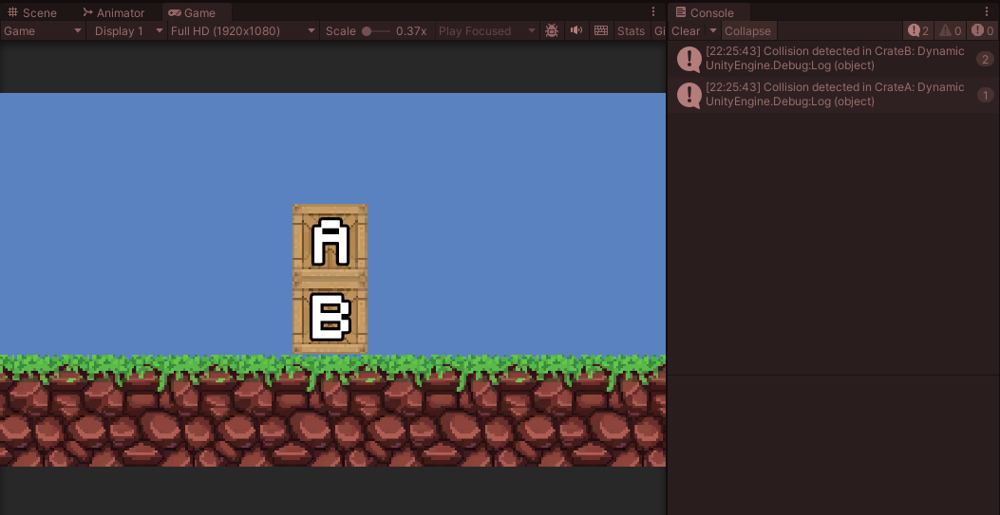

- Ambos objetos tienen físicas y uno de ellos tiene 10 veces más masa que el otro.

El comportamiento es muy similar al anterior caso.

- Un objeto tiene físicas y el otro es IsTrigger.

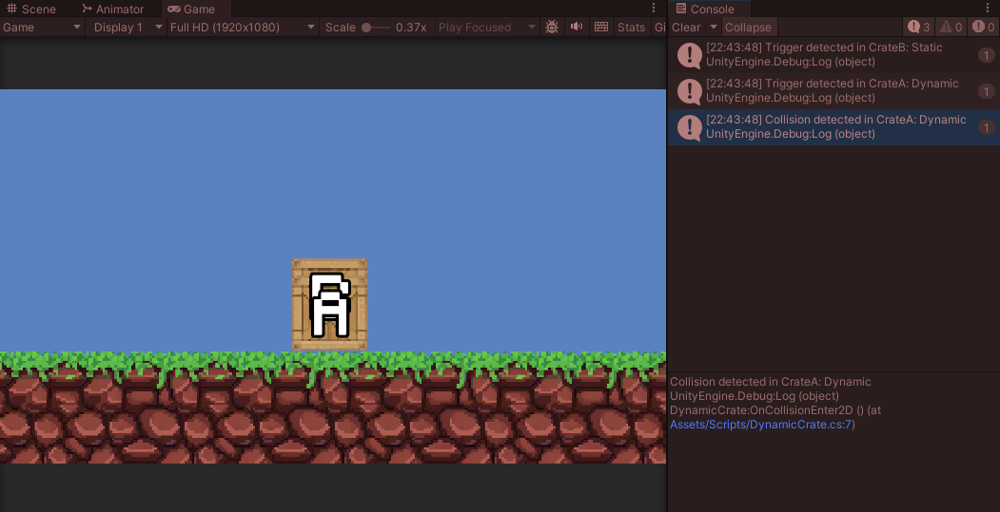

- Ambos objetos son físicos y uno de ellos está marcado como IsTrigger.

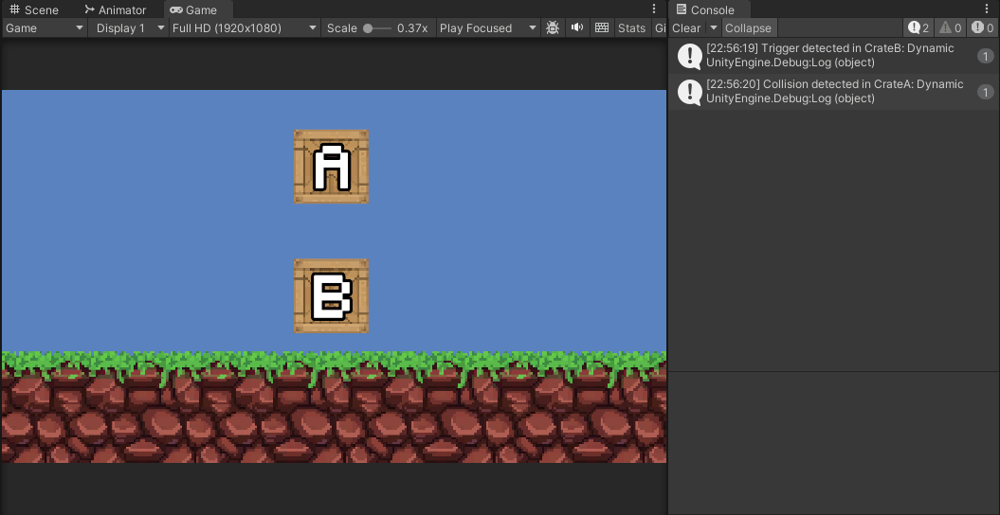

- Uno de los objetos es cinemático.

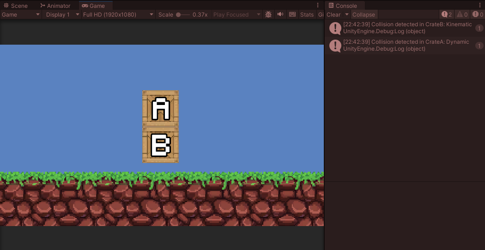

2. Incorpora elementos físicos en tu escena que respondan a las siguientes restricciones:

- Objeto estático que ejerce de barrera infranqueable

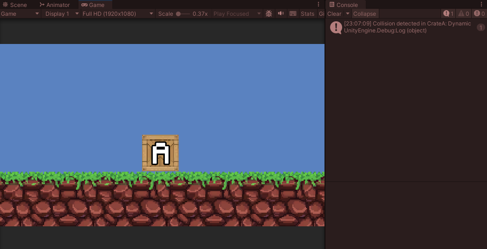

- Zona en la que los objetos que caen en ella son impulsados hacia adelante

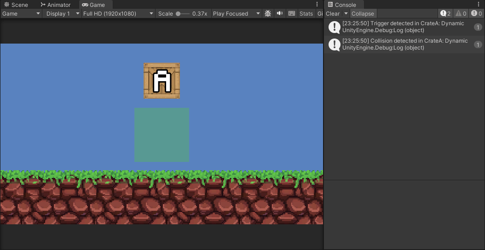

Script: [ImpulseTrigger.cs](scripts/ImpulseTrigger.cs)

- Objeto que es arrastrado por otro a una distancia fija

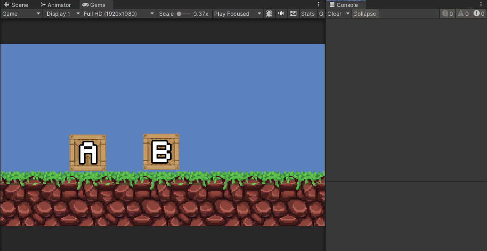

Script: [DragBox.cs](scripts/DragBox.cs)

- Objeto que al colisionar con otros sigue un comportamiento totalmente físico.

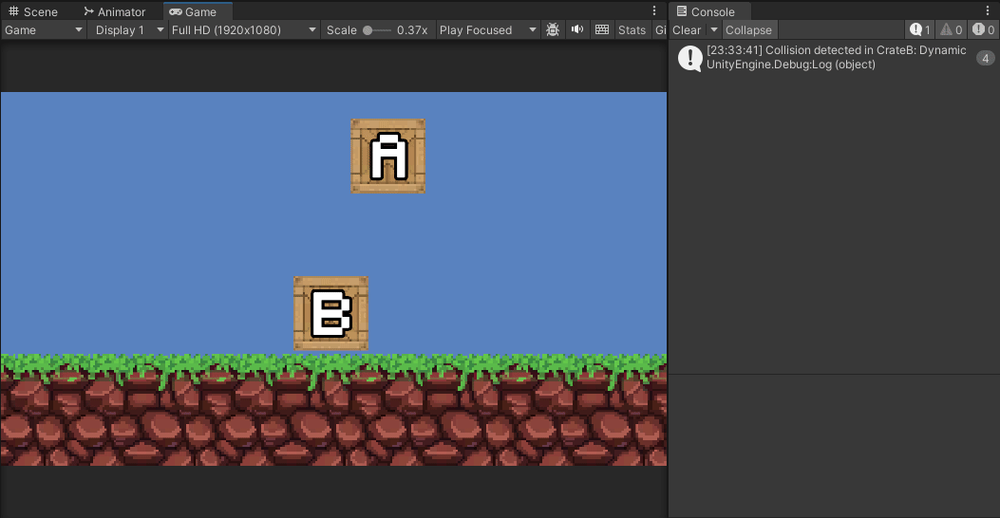

- Incluye dos capas que asignes a diferentes tipos de objetos y que permita evitar colisiones entre ellos.

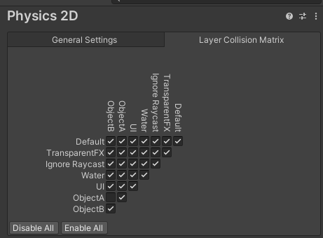

3. Partiendo de la escena implementada para la tarea de Sprites  construiremos un mapa de juego, que delimitará la zona en la que tendrá lugar la acción. Utiliza los recursos en el paquete generado para la práctica. Debes crear una paleta con los Tiles que consideres. Ajusta el tamaño de los Tiles al tamaño de celda del grid y subdivide aquellos Tiles que ocupen un grupo de celdas. Generar un mapa convencional que represente el entorno y límites de juego. Actividades a realizar:
- Crea dos Tilemaps adicionales de obstáculos. Uno puede representar elementos decorativos y otro obstáculos.
- Agrega a la capa de obstáculos la configuración necesaria para que el Tilemap se construya de forma independiente y el obstáculo actúe como tal.

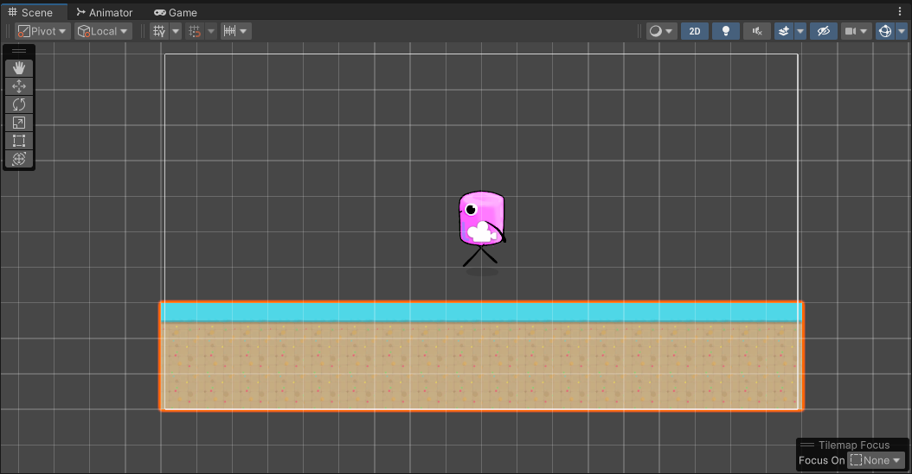

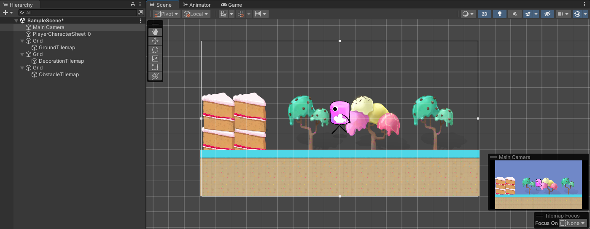

3. Se han implementado las siguientes funcionalidades al proyecto:
- Control del personaje basado en físicas
- Salto
- Mecánicas relacionadas con plataformas
- Salto a una plataforma
- Plataformas invisibles que se vuelven visibles
- Mecánica de recolección

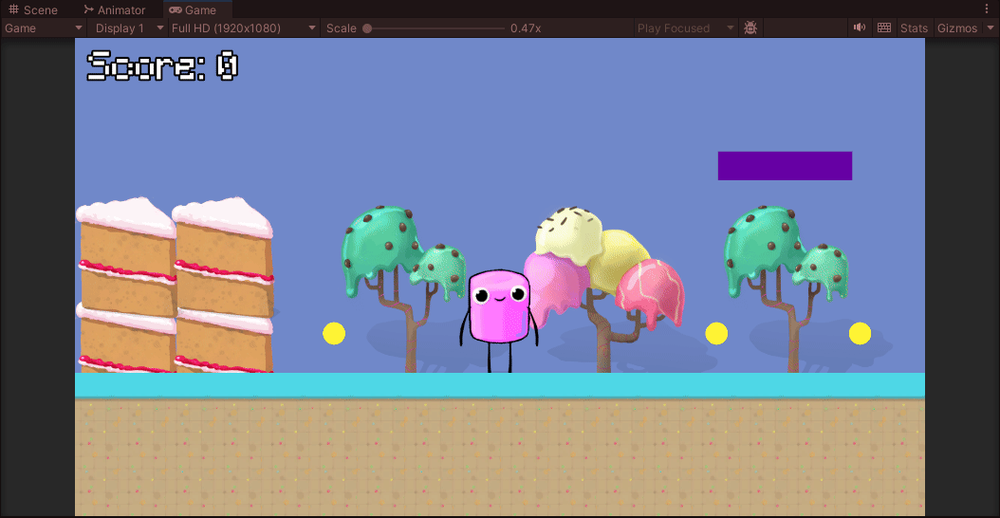

Scripts: [Collectible.cs](scripts/Collectible.cs) [InvisiblePlatform.cs](scripts/InvisiblePlatform.cs) [MovingPlatform.cs](scripts/MovingPlatform.cs) [GameUI.cs](scripts/GameUI.cs) [PlayerController.cs](scripts/PlayerController.cs)